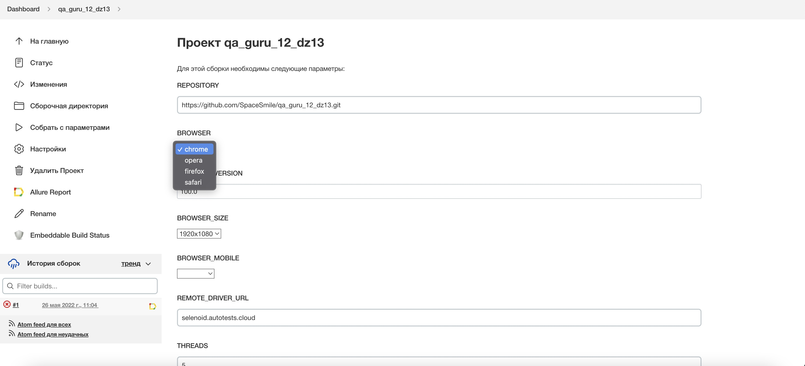

# Проект по автоматизации тестирования онлайн магазина по стройматериалам "Баунцентр"
## <a target="_blank" href="https://baucenter.ru/">baucenter.ru</a>

## :floppy_disk: Содержание:

- <a href="#computer-технологии-и-инструменты">Технологии и инструменты</a>
- <a href="#notebook_with_decorative_cover-реализованные-проверки">Реализованные проверки</a>
- <a href="#electric_plug-сборка-в-Jenkins">Сборка в Jenkins</a>
- <a href="#arrow_forward-запуск-из-терминала">Запуск из терминала</a>
- <a href="#open_book-allure-отчет">Allure отчет</a>
- <a href="#hammer-allure-test-ops-отчет">Allure Test Ops отчет</a>
- <a href="#wrench-интеграция-с-jira">Интеграция с Jira</a>
- <a href="#robot-отчет-в-telegram">Отчет в Telegram</a>
- <a href="#film_projector-видео-примеры-прохождения-тестов">Видео примеры прохождения тестов</a>

## :computer: Технологии и инструменты
<p align="center">


</p>

## :notebook_with_decorative_cover: Реализованные проверки
- Проверка выбора города на главной странице
- Проверка работы поиска товара и добавления его в корзину
- Проверка работы каталога и выбор товара в разделе строительных материалов
- Проверка выбора раздела Акции!, Новинки, Бонусы и скидки, Сервисы, Советы.
- Проверка отсутствия ошибок в консоли бразуера

## :electric_plug: Сборка в Jenkins
### <a target="_blank" href="https://jenkins.autotests.cloud/job/qa_guru_12_dz13/">Сборка в Jenkins</a>
<p align="center">

</p>  

## :arrow_forward: Запуск из терминала
Локальный запуск:
```
gradle clean test
```
## :gear: Запуск тестов с выбором параметров


Удаленный запуск:
```
clean
test
-Dbrowser=${BROWSER}
-DbrowserVersion=${BROWSER_VERSION}
-DbrowserSize=${BROWSER_SIZE}
-DbrowserMobileView="${BROWSER_MOBILE}"
-DremoteDriverUrl=https://${REMOTE_DRIVER_LOGIN}:${REMOTE_DRIVER_PASSWORD}@${REMOTE_DRIVER_URL}/wd/hub/
-DvideoStorage=https://${REMOTE_DRIVER_URL}/video/
```
:monocle_face: Попробуйте - это очень удобно!
- -Dbrowser - можно выбрать браузер, который необходимо открыть именно вам
  (chrome,
  opera,
  firefox,
  safari)
- -DbrowserVersion - выберете нужную версию браузера
- -DbrowserSize - возможность упралять разрешением (1920x1080,
  1366x768,
  1280x1024,
  1280x800,
  1024x768)
- -DbrowserMobileView - возможность проверить свой продукт на мобильном устройстве (браузере)
- -DremoteDriverUrl - попробуйте выбрать свой аеро куб :)

## :open_book: Allure отчет
- ### Главный экран отчета
<p align="center">

</p>

- ### Страница с проведенными тестами
<p align="center">

</p>

## :wrench: Интеграция с Jira
<p align="center">

</p>

## :robot: Отчет в Telegram
<p align="center">

</p>

## :film_projector: Видео примеры прохождения тестов
> К каждому тесту в отчете прилагается видео. Одно из таких видео представлено ниже.
<p align="center">
  
</p>